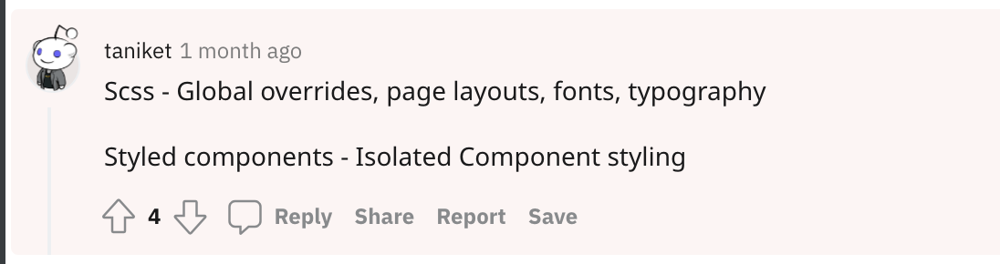

# Styled vs Scss

styled-component

* props에 의해 [변화](https://velog.io/@qksud14/portfolio-05)가 통제

scss

* BEM, OOCSS, ITCSS 등 방법론

#### **정리**

 [https://www.reddit.com/r/reactjs/comments/my6dnw/styled\_components\_vs\_sass\_sheets/](https://www.reddit.com/r/reactjs/comments/my6dnw/styled_components_vs_sass_sheets/gvvt95i?utm_source=share&utm_medium=web2x&context=3)

#### **참고**

* [https://velog.io/@qksud14/portfolio-05](https://velog.io/@qksud14/portfolio-05)
* [https://blueshw.github.io/2020/09/14/why-css-in-css/](https://blueshw.github.io/2020/09/14/why-css-in-css/)

