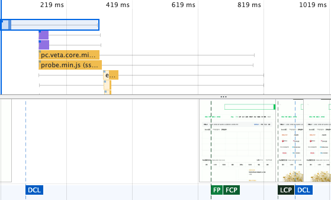
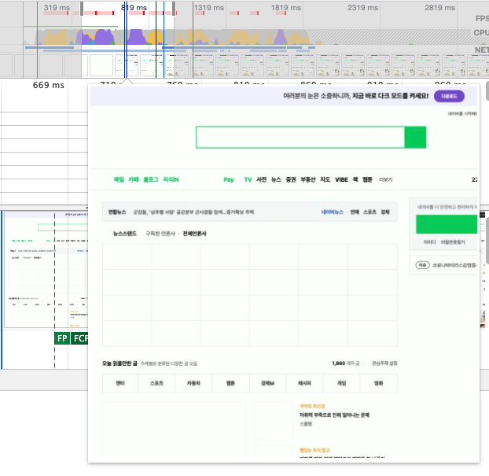

# Chrome - performance

\[dev tool\] - \[performancw\]

여기서 제일중요한 것은 **FCP, LCP**라고 볼 수 있다.


**FCP** - 첫 화면을 그려지는 부분

**LCP** - 가장 큰 컨텐츠가 그려지는 부분


네이버는 첫 화면이 그려지는데 약 0.7초, 컨텐츠를 그리는데 0.85초라는 것을 알수있다.  
1초이내에 화면이 전체가 로드된다는 뜻이다

