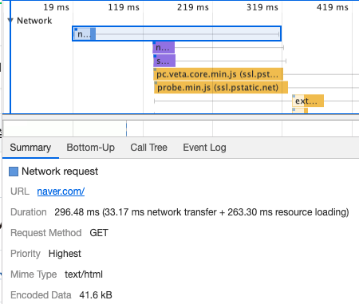
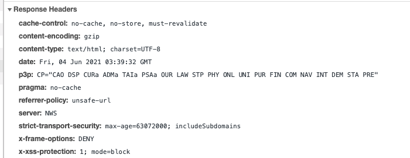

# 네이버

naver.com 접속시 용량 **41.6kb**의 html 파일을 받아옵니다.

I. cache-control [여기](https://developer.mozilla.org/ko/docs/Web/HTTP/Headers/Cache-Control)

* naver.com 첫 화면은 cache처리를 하지 않는 것을 알수 있다.

II. content-encoding

* 클라이언트 측에서 `accept-encoding:gzip, deflate, br` 을 header에 넣어서 gzip 형태로 요청을 하였고, 서버측에서 응답을 주었다.

III. p3p\(Platform for Privacy Preferences Protocol\) [여기](https://sir.kr/pg_tip/14397)

* 브라우져가 개인정보 접근하겠다는 정보

III. pragama - 과거 HTTP1.0 cache 설정

IV. referrer-policy [여기](https://developer.mozilla.org/en-US/docs/Web/HTTP/Headers/Referrer-Policy)

V. strict-transport-security [여기](https://developer.mozilla.org/ko/docs/Web/HTTP/Headers/Strict-Transport-Security)

* HTTP 대신 HTTPS만을 사용하여 통신해야한다고 웹사이트가 브라우저에 알리는 보안 기능

VI. x-frame-options [여기](https://developer.mozilla.org/ko/docs/Web/HTTP/Headers/X-Frame-Options)

* Deny - 어떠한 사이트에서도 frame 상에서 보여질 수 없습니다. \(frame, iframe, object\)
  * **클릭재킹** 을 막기위해서 사용.

VII. X-XSS-Protection [여기](https://developer.mozilla.org/ko/docs/Web/HTTP/Headers/X-XSS-Protection)

* x-xss-protection: 1; mode=block
  * XSS 공격을 감지하면 페이지로드를 차단합니다.

